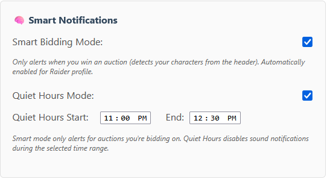
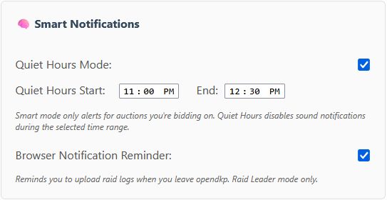
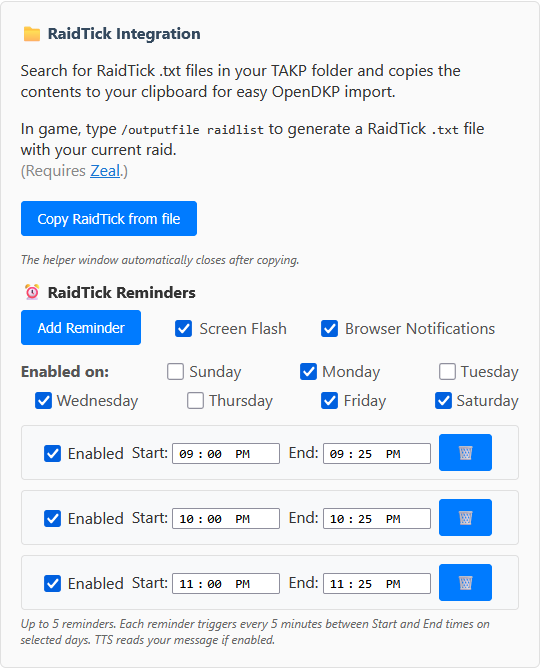
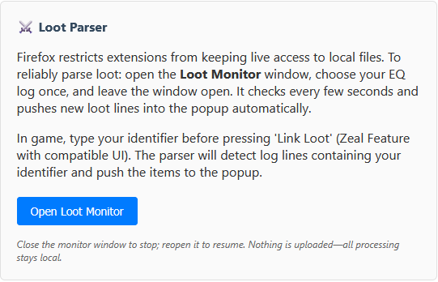
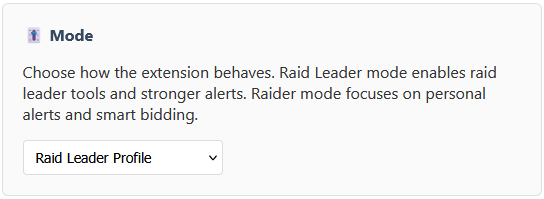
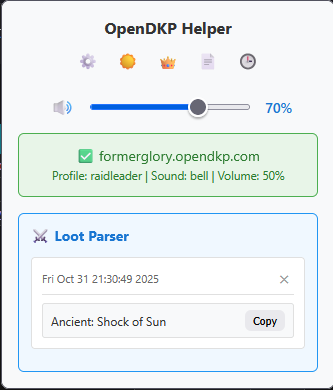
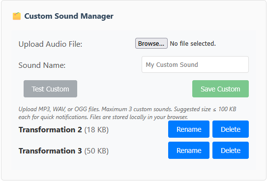
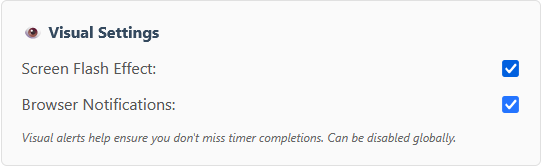

# OpenDKP Helper - Browser Extension

A comprehensive browser extension for opendkp.com that provides intelligent auction monitoring, notifications, and RaidTick integration features.

## 🎯 Core Features

### Auction Timer Monitoring
- ✅ **Automatic Timer Detection** - Monitors all auction timer progress bars on opendkp.com
- ✅ **Dynamic Detection** - Uses MutationObserver to detect timers added dynamically
- ✅ **Smart Alerts** - Plays notification when timer reaches 0%
- ✅ **Duplicate Prevention** - Prevents duplicate alerts for the same timer
- ✅ **Progress Tracking** - Only alerts for auctions you've actually observed in progress

### Sound System
- ✅ **Multiple Sound Profiles**
  - **Raid Leader Profile** - Authoritative sounds (Bell, Chime, Ding variations)
  - **Raider Profile** - Gentle sounds (Chime, Ding, Bell)
- ✅ **Built-in Sounds** - Bell, Chime (hotel bell sound), Ding (4 variations), Warcraft sounds (Job's Done, Work Complete)
  - Note: The "Chime" option plays the hotel bell sound (hotel.mp3 file)
- ✅ **Custom Sound Upload** - Upload your own MP3, WAV, or OGG files (up to 3 custom sounds)
- ✅ **Volume Control** - Adjustable volume slider (0-100%)
- ✅ **Profile-Specific Sounds** - Each profile remembers its preferred sound


### Text-to-Speech (TTS)
- ✅ **Speech Announcements** - Announces auction completions with customizable messages
- ✅ **Voice Selection** - Choose from available system voices
- ✅ **Speed Control** - Adjustable voice speed (0.5x - 2.0x)
- ✅ **Custom Templates** - Create custom TTS messages with placeholders:
  - `{winner}` - Winner's name
  - `{bidAmount}` - Bid amount
  - `{itemName}` - Item name
- ✅ **New Auction Readouts** - Speaks "New auction: Item Name" when auctions appear


### Smart Notifications
- ✅ **Smart Bidding Mode (Raider Profile)** - Only alerts when YOU win an auction you bid on
  - Automatically detects your characters from the page header
  - Only triggers notifications when your character wins
  - Perfect for raiders who only want to know about their own wins
  - Automatically enabled when Raider profile is selected



- ✅ **Quiet Hours** - Disable sound notifications during specified hours
  - Customizable start and end times
  - Visual alerts still work during quiet hours
- ✅ **Screen Flash** - Visual alert that flashes the screen
- ✅ **Browser Notifications** - Desktop notifications with auction details
  - Shows winner, item, and bid amount
  - Click to view auction details



### RaidTick Integration (Raid Leader Only)
- ✅ **Quick Copy-to-Clipboard** - Easily copy RaidTick file contents for OpenDKP import
- ✅ **File Browser** - Select your RaidTick folder or pick files individually
- ✅ **Automatic Parsing** - Extracts raid list data and copies to clipboard
- ✅ **How It Works**:
  - In-game, type `/outputfile raidlist` (requires Zeal)
  - This generates a `RaidTick-YYYY-MM-DD_HH-MM-SS.txt` file
  - Use the extension to copy the file contents
  - Paste directly into OpenDKP to import your raid list



### Loot Parser / EQ Log Monitoring (Raid Leader Only)
- ✅ **EQ Log File Selection** - Select your EverQuest log file to monitor
- ✅ **Loot Line Detection** - Automatically detects loot lines containing your tag
- ✅ **Monitoring Window** - Dedicated window to monitor log activity in real-time
- ✅ **Event Extraction** - Extracts item names from loot messages
- ✅ **Tag Configuration** - Customize the loot tag to search for (e.g., "FG")
- ✅ **Event Tracking** - Tracks detected loot events and displays them
- ✅ **Date Filtering** - Shows only today's loot events in the popup
- ✅ **Manual Refresh** - Refresh button to rescan files and update events
- ✅ **How It Works**:
  - In-game, type your identifier before pressing 'Link Loot' (Zeal feature)
  - The parser monitors your EQ log file for messages containing your tag
  - Detected loot items are extracted and displayed in the extension popup
  - Copy buttons copy the item text to your clipboard so you can easily paste them into the Bidding Tool



### RaidTick Reminders (Raid Leader Only)
- ✅ **Scheduled Reminders** - Set reminders for specific times (e.g., "Run /outputfile raidlist")
- ✅ **Recurring Reminders** - Daily, weekly, or custom schedule
- ✅ **Day-of-Week Filtering** - Enable/disable reminders for specific days
- ✅ **Multiple Reminder Types**:
  - Screen flash
  - Browser notifications
  - Popup window
- ✅ **5-Minute Boundaries** - Fires at :00 and :30 of each 5-minute interval
- ✅ **Copy Button** - copies /outputfile raidlist to your clipboard so you can paste it into the game

### Other Features
- ✅ **Settings Page** - Comprehensive options page with all settings
- ✅ **Dark Mode** - Dark theme for easier viewing
- ✅ **Cross-Browser** - Works in Firefox and Chrome
- ✅ **Persistent Storage** - All settings saved and synced across browser instances
- ✅ **Test Functions** - Test sounds, notifications, and TTS before saving

## 📦 Installation

### Option 1: Download from GitHub Releases (Recommended)

Pre-built packages are available for both Chrome and Firefox on the [Releases](https://github.com/LordDemonos/opendkp-helper/releases) page.

#### Chrome Installation:
1. Download `opendkp-helper-v[X.X.X]-chrome.zip` from the latest release
2. Extract the ZIP file (it will create a folder like `opendkp-helper-v[X.X.X]-chrome`)
3. Open Chrome and navigate to `chrome://extensions`
4. Enable **Developer mode** (toggle in top-right)
5. Click **Load unpacked**
6. Select the `opendkp-helper-v[X.X.X]-chrome` folder that was created when you extracted the ZIP
7. The extension is now installed!

#### Firefox Installation:
1. Download `opendkp-helper-v[X.X.X]-firefox.zip` from the latest release
2. Open Firefox and navigate to `about:debugging`
3. Click **This Firefox** tab
4. Click **Load Temporary Add-on...**
5. Select the ZIP file you downloaded
6. The extension is now installed!

**Note:** Release packages are automatically built with the correct manifest configuration for each browser.

### Option 2: Official Browser Stores

- **Chrome**: Available on [Chrome Web Store](https://chrome.google.com/webstore/) (Coming Soon)
- **Firefox**: Available on [Firefox Add-ons (AMO)](https://addons.mozilla.org/)

### Option 3: Manual Installation from Source (Development/Testing)

If you're building from source or testing a development version, you'll need to configure `manifest.json` differently for each browser:

#### For Chrome:
The `manifest.json` should use `background.service_worker`:
```json
{
  "background": {
    "service_worker": "background.js"
  }
}
```

#### For Firefox:
The `manifest.json` should use `background.scripts`:
```json
{
  "background": {
    "scripts": ["background.js"]
  },
  "browser_specific_settings": {
    "gecko": {
      "id": "opendkp-helper@opendkp.com",
      "strict_min_version": "126.0"
    }
  }
}
```

**Note**: The GitHub Actions workflows automatically handle this conversion when building packages. See [Building from Source](#-building-from-source) below.

#### Installation Steps:

1. **Download or clone the repository**
   ```bash
   git clone https://github.com/LordDemonos/opendkp-helper.git
   cd opendkp-helper
   ```

2. **Edit `manifest.json`** based on your browser (see above)

3. **Load the extension**:
   - **Chrome**: Open `chrome://extensions` → Enable "Developer mode" → "Load unpacked" → Select the extension folder
   - **Firefox**: Open `about:debugging` → "This Firefox" → "Load Temporary Add-on" → Select `manifest.json`

## 🚀 Quick Start

1. **Install the extension** (see [Installation](#-installation) above) 

2. **Open Settings:**
   - Right-click the extension icon → "Options" or "Manage Extension"
   - Or click the extension icon and click "Settings"

3. **Choose Your Mode:**
   - **Raid Leader Profile** - Full features including RaidTick and Loot Parser
   - **Raider Profile** - Smart Bidding mode, only alerts when you win
   
   

4. **For Raiders - Smart Bidding:**
   - Select **Raider Profile** (Smart Bidding is auto-enabled)
   - The extension will only alert when YOU win auctions you bid on
   - Your character names are automatically detected from the page
   
   

5. **For Raid Leaders - Set Up RaidTick:**
   - Select **Raid Leader Profile**
   - Click "Copy RaidTick from file" to copy raid lists to clipboard
   - Or select your RaidTick folder in settings to browse files in popup
   - Configure **RaidTick Reminders** to get reminders to run `/outputfile raidlist`
   
   

6. **For Raid Leaders - Set Up Loot Parser:**
   - Enable **Loot Parser** (visible in Raid Leader profile)
   - Select your EverQuest log file
   - Configure your loot tag (e.g., "FG" for Former Glory)
   - The parser will monitor your log and display loot events in the popup
   
   

7. **Configure Audio & Visuals:**
   - Set up **Quiet Hours** to silence notifications during sleep hours
   - Configure **Text-to-Speech** if you want audio announcements
   - Adjust volume and notification preferences

8. **Save Settings** and start using!

   

## ⚙️ Settings Reference

### Audio Settings
- **Sound Profile**: Choose Raid Leader, Raider
- **Notification Sound**: Select from built-in or custom sounds
- **Volume**: 0-100% volume slider


### Text-to-Speech
- **Enable Text-to-Speech**: Toggle TTS announcements
- **Voice**: Select system voice
- **Voice Speed**: Adjust playback speed (0.5x - 2.5x)
- **Advanced TTS**: Enable custom message templates
- **Read New Auctions**: Announce new auctions when they appear
- **Time Windows**: Set when TTS is active

### Custom Sound Manager
- **Upload Audio File**: Upload MP3, WAV, or OGG files
- **Sound Name**: Name your custom sound
- **Maximum**: 3 custom sounds
- **Size Limit**: Suggested ≤100 KB per file



### Smart Notifications
- **Smart Bidding Mode (Raider)**: Only alert when you win auctions you bid on (auto-enabled for Raider profile)
- **Quiet Hours**: Disable sounds during specified hours
- **Screen Flash**: Visual alert when auctions complete
- **Browser Notifications**: Desktop notifications with details


### RaidTick Integration (Raid Leader Only)
- **Copy RaidTick from file**: Quick button to select and copy RaidTick file contents to clipboard
- **RaidTick Folder**: Select folder containing RaidTick .txt files for date-based browsing in popup
- **Reminders**: Schedule reminders for tasks like "Run /outputfile raidlist"

### Loot Parser (Raid Leader Only)
- **Loot Parser Enabled**: Enable/disable EQ log monitoring
- **EQ Log File**: Select your EverQuest log file
- **Loot Tag**: Configure the tag to search for in log messages (e.g., "FG")
- **Monitoring Window**: Open dedicated window to monitor log activity

### Visual Settings
- **Screen Flash**: Enable/disable screen flash alerts
- **Browser Notifications**: Enable/disable desktop notifications
- **Disable Visuals**: Global toggle to disable all visual alerts



## 🔧 File Structure

```
opendkp-helper/
├── manifest.json              # Extension manifest
├── background.js              # Background script (reminders)
├── content.js                 # Main content script (timer monitoring)
├── options.html               # Settings page HTML
├── options.js                 # Settings page logic
├── popup.html                 # Popup window HTML
├── popup.js                   # Popup logic (Chrome)
├── popup-firefox.js           # Popup logic (Firefox)
├── reminder.html              # Reminder popup window
├── reminder.js                # Reminder logic
├── eqlog-monitor.html         # EQ Log monitoring window
├── eqlog-monitor.js           # EQ Log monitoring logic
├── eqlog-window.html          # EQ Log viewer window
├── eqlog-window.js            # EQ Log viewer logic
├── copy-window.html           # Copy utility window
├── copy-window.js             # Copy utility logic
├── icons/                      # Extension icons
│   ├── icon.svg
│   ├── icon-16.png
│   ├── icon-48.png
│   └── icon-128.png
├── *.mp3, *.wav               # Audio files
└── README.md                   # This file
```

## 🎨 Browser Compatibility

- ✅ **Chrome/Edge 88+** (Manifest v3)
- ✅ **Firefox 126.0+** (Manifest v3)

**Note**: Both browsers require Manifest V3. Chrome uses `background.service_worker` while Firefox uses `background.scripts`. The extension automatically detects and uses the appropriate API based on the browser.

## 🔨 Building from Source

The repository includes GitHub Actions workflows that automatically build browser-specific packages:

- **Release Builds**: `.github/workflows/build-release.yml` - Builds both Chrome and Firefox ZIP files for GitHub Releases
- **Chrome Store**: `.github/workflows/publish-chrome.yml` - Builds and optionally uploads to Chrome Web Store
- **Firefox Store**: `.github/workflows/publish-firefox.yml` - Builds and publishes to Firefox Add-ons (AMO)

### Release Builds

The `build-release.yml` workflow automatically:
1. Triggers on new GitHub releases (or can be manually triggered)
2. Builds both Chrome and Firefox packages with correct manifest configurations
3. Attaches both ZIP files to the release

**To create a new release:**
1. Create a new release on GitHub (tagged with version number)
2. The workflow will automatically build and attach both packages
3. Users can download the appropriate ZIP for their browser

### Store Builds

Store-specific workflows:
1. Configure `manifest.json` for the target browser (scripts vs service_worker)
2. Package all necessary files
3. Create ZIP files ready for store submission

To build manually:

1. **For Chrome**: The workflow sets `background.service_worker` in manifest.json
2. **For Firefox**: The workflow sets `background.scripts` in manifest.json

When building from source, you must edit `manifest.json` manually (see [Installation](#-installation) above).

## 🔐 Permissions

This extension requires the following permissions:

- **activeTab** - Access current tab to monitor auction timers
- **storage** - Save your settings and preferences
- **notifications** - Display browser notifications
- **clipboardWrite** - Copy auction information to clipboard
- **management** - Extension management (for future features)
- **scripting** - Inject content scripts

All data is stored locally in your browser - nothing is sent to external servers.

## 📄 License

MIT License - Feel free to modify and distribute.

## 🤝 Contributing

Contributions welcome! When adding features:

1. Maintain the modular code structure
2. Add settings to the options page
3. Include test functions where applicable
4. Update this README with new features
5. **Test on both Firefox and Chrome** - The extension uses different manifest configurations:
   - Firefox: Uses `background.scripts`
   - Chrome: Uses `background.service_worker`
6. Ensure cross-browser compatibility - The code handles browser differences automatically (e.g., `chrome` vs `browser` API)

## 🆘 Support

For issues, questions, or feature requests:
- Check the browser console for error messages
- Test individual features using the test buttons in settings
- Issues, Pull Requests, and Suggestions are welcome!

### Common Issues

**Extension not loading after manual installation:**
- Ensure `manifest.json` uses the correct `background` format for your browser (see [Installation](#-installation))
- Check the browser console for errors (F12 → Console)
- Verify all required files are present (see [File Structure](#-file-structure))

**RaidTick reminders not working in Chrome:**
- Chrome requires `background.service_worker` (not `scripts`) in manifest.json
- Ensure the extension is reloaded after changing manifest.json
- Check background script console: `chrome://extensions` → Developer mode → Extension details → Service worker
---

**Note**: This extension is specifically designed for opendkp.com. If the site updates its markup, some features may need adjustments.
