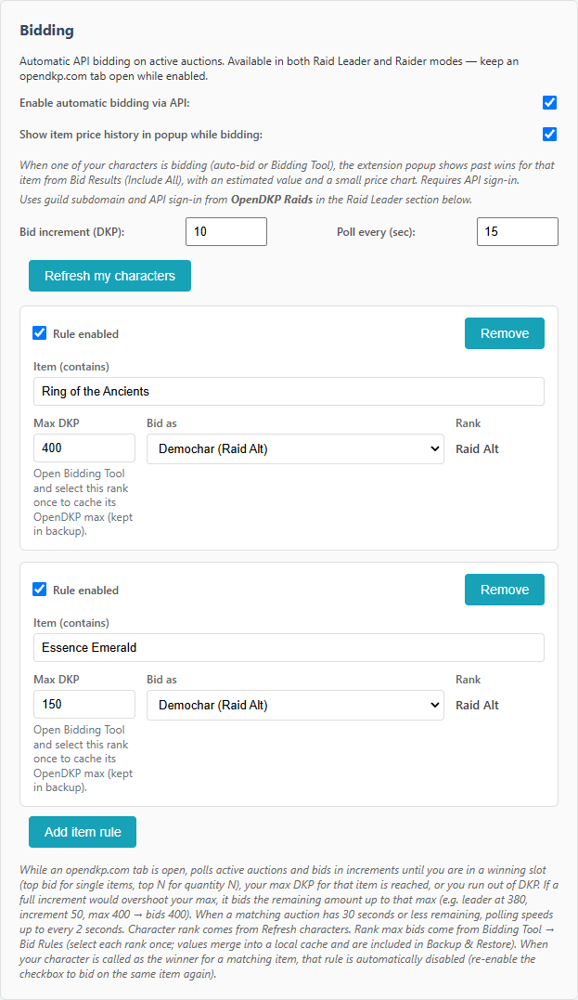
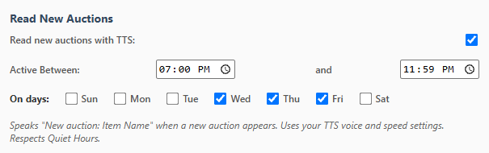
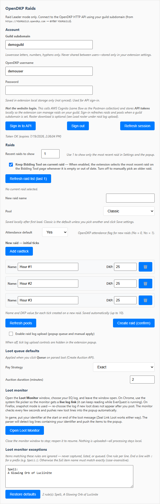
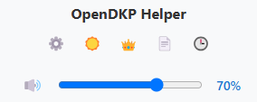
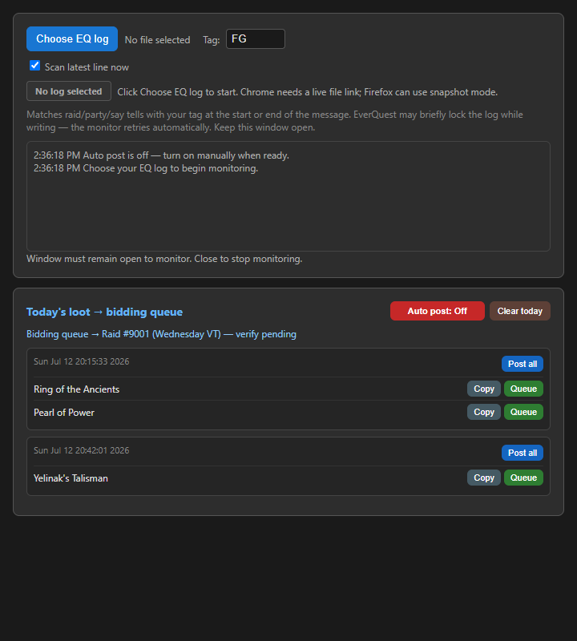
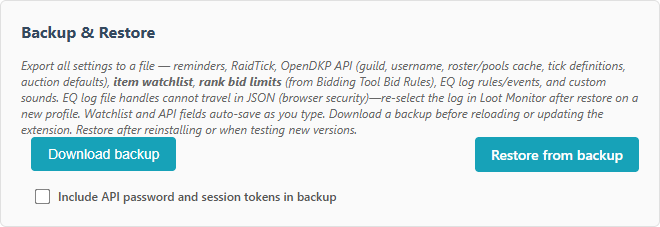
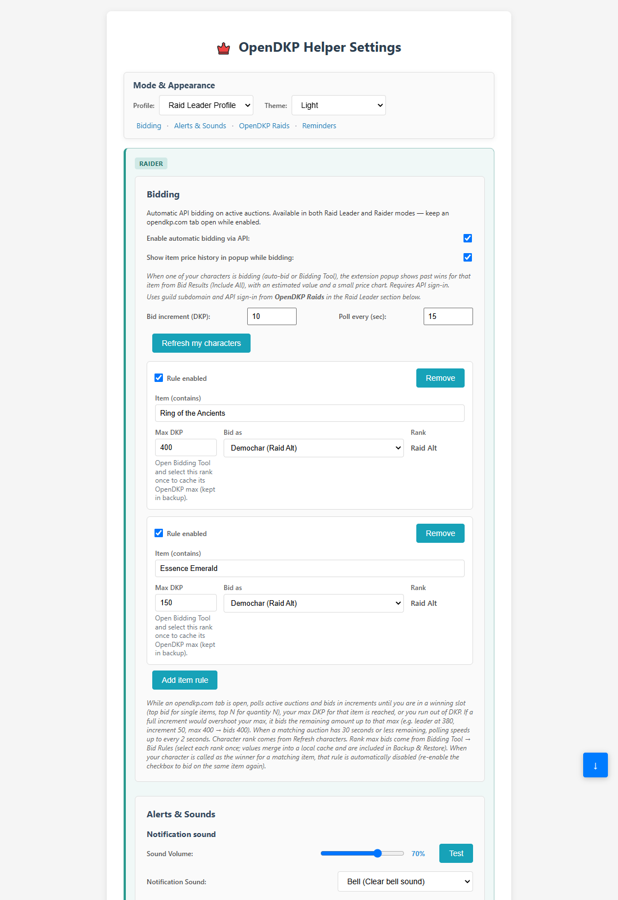

# OpenDKP Helper

Browser extension for [opendkp.com](https://opendkp.com): auction alerts, optional auto-bid, and raid-leader tools for RaidTick reminders, EQ loot monitoring, and OpenDKP API raids.

Works in **Chrome**, **Edge**, and **Firefox**. Current version: **2.5.0**.


---

## What it does

OpenDKP Helper runs while you use opendkp.com. It can:

- Alert when auction timers hit zero (sound, screen flash, desktop notification, or TTS).
- Auto-bid on items you care about through the OpenDKP API (with guild rank bid limits).
- For **raiders**: notify only when *your* character wins an auction you joined.
- For **raid leaders**: monitor EQ loot logs, queue items to bidding, manage tonight’s raid, and stage RaidTick uploads from the popup.

Settings stay in your browser. API passwords and tokens never leave your machine except to OpenDKP / AWS Cognito when you sign in.

---

## Features

### Mode & Appearance

Pick **Raid Leader** or **Raider**, and light / dark / system theme. Settings use a sticky Mode bar and a section TOC.


### Bidding (auto-bid)

Available in both profiles. Sign in once (raid leaders reuse OpenDKP Raids credentials). Add per-item rules: name match, max DKP, character, and rank. The extension polls active auctions, bids in your increment, accelerates to every **2 seconds** in the last 30 seconds, and can place an **all-in** bid up to your max when a full increment would overshoot. Rules turn off when you win that item. Rank bid limits sync from your guild’s Bid Rules on opendkp.com.



### Alerts & Sounds

Built-in bell, chime, ding, and optional Warcraft-style clips; up to three custom uploads; volume control.


**Text-to-speech** — optional voice, speed, and custom templates (`{winner}`, `{bidAmount}`, `{itemName}`, …).


**Read New Auctions** — speak new auction titles during a day/time window you choose.



**Watchlist, quiet hours, visuals** — alarm when listed items appear; mute sounds overnight; screen flash and browser notifications.


**Raider Smart Bidding** — only alert when you win an auction you participated in.


### OpenDKP Raids (raid leader)

Sign in with guild subdomain + OpenDKP login. Create or select tonight’s raid, set loot queue defaults, enable raid log upload controls in the popup, open the loot monitor, and maintain loot exceptions (spell lines / junk items) in Settings.



**Bidding Tool raid lock** — optionally keep the opendkp.com Bidding Tool on the most recent raid so queued loot lands on the right night.

### Reminders (raid leader)

Scheduled RaidTick reminders (`/outputfile raidlist`) with a master on/off switch, day filters, flash, and notifications. Optional “upload raid logs” nudge when leaving opendkp.com.


### Popup — raid night controls

Volume, status, API session refresh, raid picker, per-tick RaidTick queue (review names, then upload), and today’s Loot Parser with Copy / Queue / Post all.




### Loot Monitor (raid leader)

Dedicated window for your EverQuest log: live handle on Chrome, snapshot mode on Firefox; loot tag at the **start or end** of the tell; auto-post to the current raid; today’s drops list.



### Backup & Restore

Export / import settings (optional credentials). Useful when moving machines.





---

## Installation

### From browser stores (recommended)

- **[Chrome Web Store](https://chromewebstore.google.com/detail/opendkp-helper/bfojhganekfilpiigejiombkkeaclifi)** — Chrome and Chromium-based browsers (including Edge via Chrome Web Store).
- **[Firefox Add-ons (AMO)](https://addons.mozilla.org/en-US/firefox/addon/opendkp-helper/)** — Firefox.

### From GitHub Releases

Download the latest release from [GitHub Releases](https://github.com/LordDemonos/opendkp-helper/releases) if you prefer a manual / sideload install.

**Chrome or Edge**

1. Download `opendkp-helper-chrome-X.X.X.zip`.
2. Extract so `manifest.json` is in the folder you select (not nested deeper).
3. Open `chrome://extensions` → enable **Developer mode** → **Load unpacked**.

**Firefox**

1. Download `opendkp-helper-firefox-X.X.X.zip`.
2. Open `about:debugging` → **This Firefox** → **Load Temporary Add-on** → choose the ZIP.

Use the ZIP built for your browser. Do not load the repository root as an unpacked extension.

---

## Quick start

1. Install the extension.
2. Open **Settings** (toolbar icon → gear, or right-click → Options).
3. Choose **Raider** or **Raid Leader**.
4. Configure alerts (sound, TTS, quiet hours, watchlist).
5. Optional **Bidding**: enable auto-bid, sign in, refresh characters, add item rules. Keep an opendkp.com tab open while auto-bid runs.
6. **Raid leaders**: Settings → **OpenDKP Raids** → guild subdomain → Sign in → create/select raid. Open Loot Monitor from the popup; set your loot tag (e.g. `FG`). Use popup tick slots to stage RaidTick files when upload is enabled.
7. Save and use your guild’s opendkp.com site during raid night.

---

## Browser support

| Browser | Minimum | Notes |
|---------|---------|-------|
| Chrome / Edge | 88+ | Manifest V3, service worker |
| Firefox | 126+ | Manifest V3, background scripts |

---

## Privacy and permissions

- **opendkp.com** — auction timers and page content for alerts / Bid Rules.
- **api.opendkp.com** — raids, loot queue, auto-bid (when signed in).
- **AWS Cognito** — login only, with credentials you enter.
- **storage, notifications, clipboard, alarms, scripting** — settings, alerts, RaidTick/loot copy, reminders.

Demo screenshots in this README use fictional guild/character data only.

---

## Building from source

Requires Node.js 20+.

```bash
git clone https://github.com/LordDemonos/opendkp-helper.git
cd opendkp-helper
npm ci
npm run build:chrome    # → build/temp-chrome-build/
npm run build:firefox   # → build/temp-firefox-build/
npm run package:release # → dist/opendkp-helper-{browser}-X.X.X.zip + SHA256SUMS.txt
```

Optional: `npm run test:chrome` (Puppeteer smoke). README screenshots: `npm run build:chrome` then `node scripts/capture-readme-screenshots.js`.

Publishing a GitHub Release with tag `vX.Y.Z` matching `manifest.json` runs CI packaging. Store listings are updated manually from the release ZIPs when needed.

---

## License

MIT — free to use, modify, and distribute.

## Support

- [GitHub Issues](https://github.com/LordDemonos/opendkp-helper/issues)
- Test buttons in Settings for sounds / TTS / notifications
- Browser console (F12) if something fails after install

If opendkp.com changes layout, some features may need an update.
